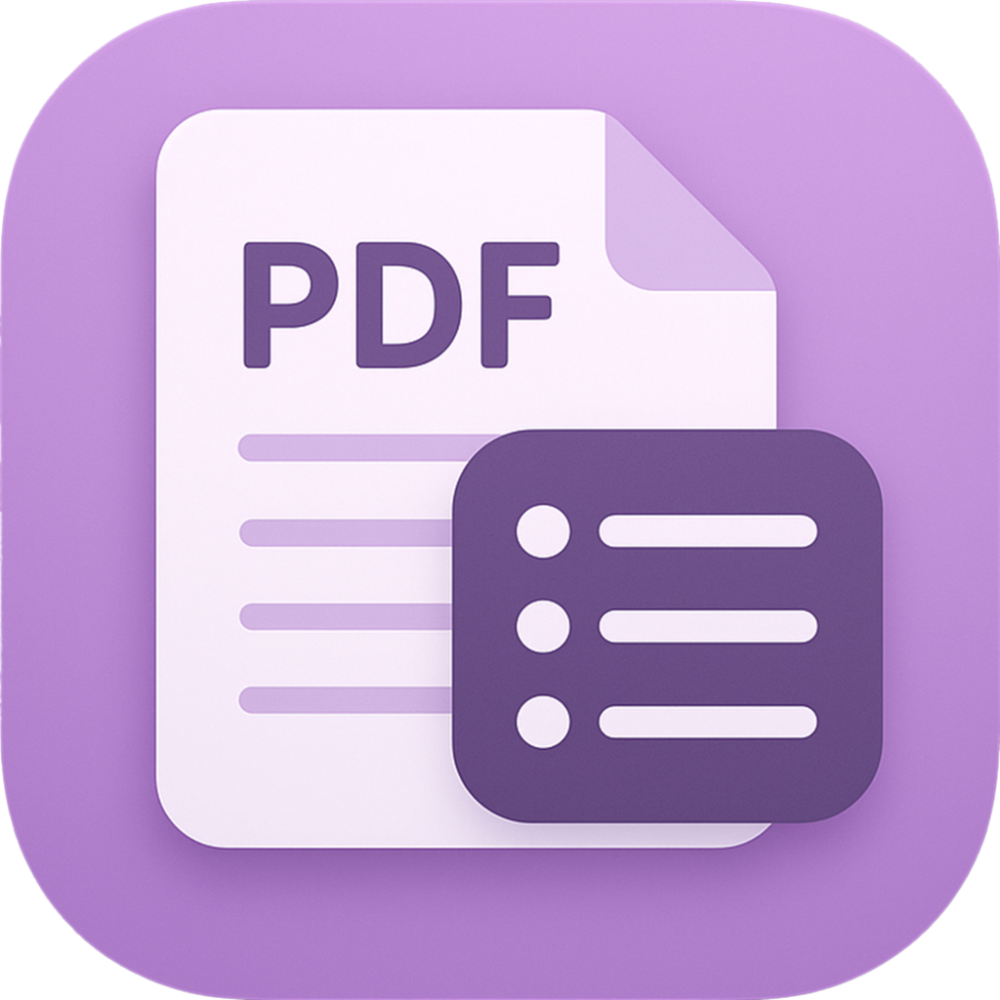
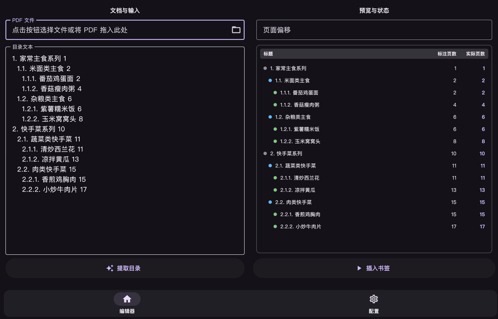

  

  <h1>Outliner</h1>
  

    
    
    
    
    
  

---

基于 Flutter 实现的用于将文本目录写入 PDF 书签的工具。

## 特性

- 从粘贴的目录文本或从 PDF 提取的现有大纲生成书签并预览解析结果
- 支持页码偏移、按缩进或正则表达式识别多级目录层级
- 使用 `syncfusion_flutter_pdf` 在本地写入书签，生成新文件（默认：`<原名>_new.pdf`）
- 跨桌面平台：Windows / macOS / Linux

## 致谢

- [syncfusion_flutter_pdf](https://pub.dev/packages/syncfusion_flutter_pdf)
- [chroming/pdfdir](https://github.com/chroming/pdfdir)
- [ifnoelse/pdf-bookmark](https://github.com/ifnoelse/pdf-bookmark)

## 许可

本项目采用 MIT 许可证，详情请参阅 [LICENSE](LICENSE) 文件。
